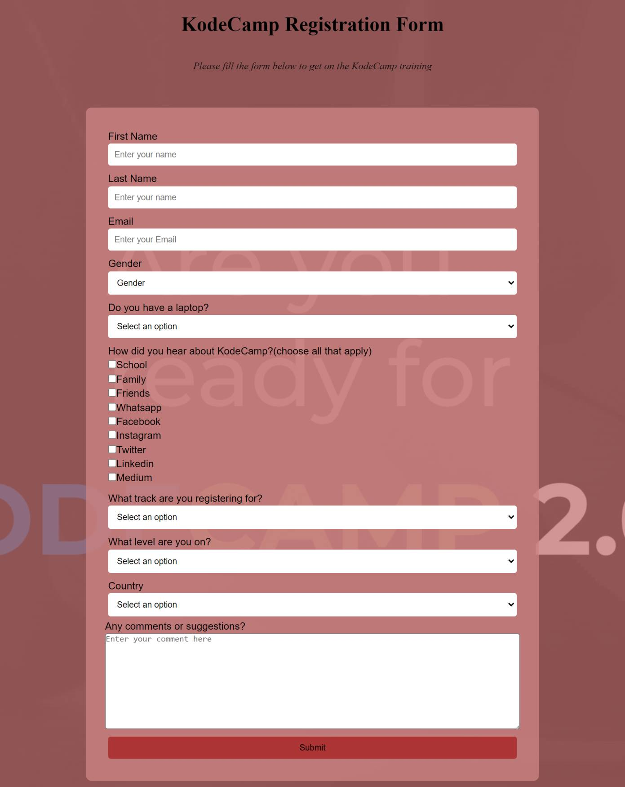

# Survey-form

## Welcome! 👋

Thanks for checking out this challenge out.

**To do this challenge, you need a basic understanding of HTML and CSS.**

## The challenge

Your challenge is to build out this feature section and get it looking as close to the design as possible.

You can use any tools you like to help you complete the challenge. So if you've got something you'd like to practice, feel free to give it a go.

## Building your project

Feel free to use any workflow that you feel comfortable with. 

## Deploying your project

There are many ways to host your project for free. Hosts include:

- [GitHub Pages](https://pages.github.com/)
- [Vercel](https://vercel.com/)
- [Netlify](https://www.netlify.com/)

## built-with

Built with HTML, CSS and media queries.

## Got feedback for me?

Email me at nwabuegodstime@gmail.com

## Project live
[Survey form | Kodecamp training ](https://godstimenwabue.github.io/Survey-form/)

## Connect with me

[Godstime Nwabue](https://www.linkedin.com/in/godstime-nwabue-08481b128/)

**Have fun building!** 🚀